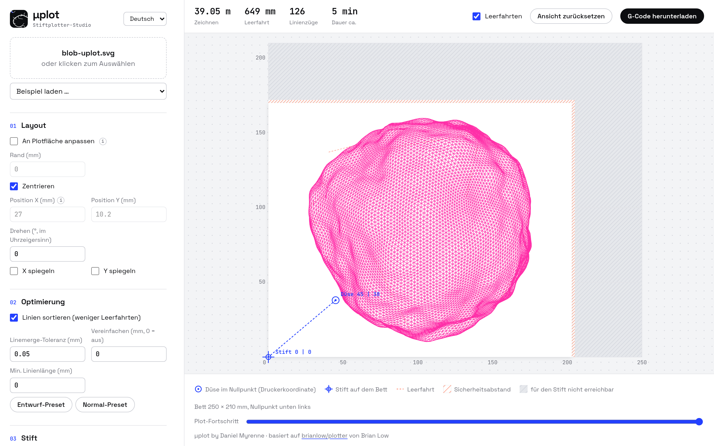

# μplot

Weboberfläche zum Stiftplotten mit einem Prusa MK3S+ (oder einem anderen 3D-Drucker mit Stifthalter).
Sie baut auf dem Workflow aus [brianlow/plotter](https://github.com/brianlow/plotter) von Brian Low auf und
ersetzt dessen `plot.sh`, `plot-draft.sh` und `vpype.toml` durch eine grafische Oberfläche.
Der G-Code entsteht mit [vpype](https://github.com/abey79/vpype) und [vpype-gcode](https://github.com/plottertools/vpype-gcode).

*Vorschau eines Mesh-Blobs aus [µgen](https://github.com/dmyrenne/ugen) mit pinkem 0,3-mm-Stift.*

## Installation mit Docker (empfohlen)

Voraussetzung: Docker (Podman geht ebenso). Das fertige Image liegt in der GitHub Container Registry
(für `linux/amd64` und `linux/arm64`, z. B. Raspberry Pi 4/5):

    docker run -d --name uplot -p 5055:5055 -v uplot-data:/data --restart unless-stopped \
      ghcr.io/dmyrenne/uplot:latest

Oder mit Compose aus diesem Repo:

    git clone https://github.com/dmyrenne/uplot.git
    cd uplot
    docker compose up -d            # lädt ghcr.io/dmyrenne/uplot:latest

Selbst aus dem Quellcode bauen: in `compose.yaml` die Zeile `build: .` einkommentieren, dann
`docker compose up -d --build`.

Danach läuft μplot unter http://localhost:5055 bzw. `http://<server>:5055`. Das Image enthält die Beispiel-SVGs aus brianlow/plotter;
sie stehen unter „Beispiel laden …“ zur Auswahl.

| Aufgabe | Befehl |
| --- | --- |
| Stoppen | `docker compose down` |
| Logs ansehen | `docker compose logs -f` |
| Aktualisieren | `docker compose pull && docker compose up -d` (selbst gebaut: `git pull && docker compose up -d --build`) |
| Profile sichern | `docker compose cp uplot:/data/presets.json .` und `docker compose cp uplot:/data/pens.json .` |
| Profile einspielen | `docker compose cp presets.json uplot:/data/presets.json` und `docker compose cp pens.json uplot:/data/pens.json` |

- Die Drucker- und Stift-Profile liegen im Docker-Volume `uplot-data` (im Container unter `/data`) und bleiben bei
  Neustarts und Updates erhalten. `docker compose down -v` löscht sie mit.
- μplot ist im ganzen Netz erreichbar. Es gibt keine Anmeldung: nur in vertrauenswürdigen Netzen betreiben oder
  hinter einen Reverse Proxy mit Anmeldung stellen. Nur vom eigenen Rechner erreichbar: in `compose.yaml`
  `"5055:5055"` durch `"127.0.0.1:5055:5055"` ersetzen.
- Anderer Port: in `compose.yaml` die linke Portnummer ändern, z. B. `"8080:5055"`.
- Die Container starten automatisch mit Docker neu (`restart: unless-stopped`).

### Image-Builds

Ein GitHub-Actions-Workflow (`.github/workflows/docker.yml`) baut das Image für amd64 und arm64 und
veröffentlicht es in `ghcr.io/dmyrenne/uplot`:

- Push auf `main` → `:latest` und `:sha-<commit>`
- Tag `v1.2.3` (`git tag v1.2.3 && git push --tags`) → zusätzlich `:1.2.3` und `:1.2`
- Pull Requests werden nur gebaut, nicht veröffentlicht.

## Installation ohne Docker

Benötigt Python 3.12 (vpype startet unter Python 3.14 nicht). Mit [uv](https://github.com/astral-sh/uv):

    uv venv --python 3.12 .venv
    uv pip install --python .venv/bin/python -r requirements.txt
    ./fetch-examples.sh     # optional: Beispiel-SVGs aus brianlow/plotter laden
    ./start.sh              # öffnet http://127.0.0.1:5055

`./start.sh --no-browser` startet den Server, ohne einen Browser zu öffnen; `--port` wählt einen anderen Port.
Die Profile liegen hier in `presets.json` (Drucker) und `pens.json` (Stifte) neben `app.py` (oder im Verzeichnis aus der Umgebungsvariable `UPLOT_DATA`).

## Funktionen

- SVG hineinziehen, Vorschau auf dem Druckbett prüfen und G-Code herunterladen. Den G-Code druckst du von SD-Karte
  oder schickst ihn mit einem Programm deiner Wahl (z. B. OctoPrint, Pronterface) per USB an den Drucker.
- PNG und JPG: werden beim Hochladen in ein SVG umgewandelt und auf die plotbare Fläche eingepasst.
  „Schraffur“ setzt Graustufen in parallele Linien um, dunkle Stellen bekommen weitere Lagen in anderen Winkeln
  (für Fotos; Linienabstand und Anzahl der Graustufen einstellbar). „Umriss“ zeichnet mit
  [potrace](https://pypi.org/project/potracer/) die Konturen der Flächen nach, die dunkler als die Schwelle sind
  (für Logos und Strichzeichnungen). Schrift und andere schmale, langgestreckte Striche (bis „Mittellinie bis“,
  Standard 10 mm Strichstärke) werden dabei nicht umrandet, sondern als ein Pfad durch die Mitte gezeichnet.
  Das erzeugte SVG lässt sich herunterladen.
- Vorschau im Maßstab des Druckbetts, Nullpunkt unten links. Düse (Kreis) und Stift (Fadenkreuz) im Nullpunkt,
  nicht erreichbare Bereiche grau, Sicherheitsabstand pink schraffiert, Leerfahrten und Plot-Fortschritt zum Scrubben.
- Layout: „An Plotfläche anpassen“ skaliert proportional, „Zentrieren“ richtet mittig aus, freier Drehwinkel,
  X/Y spiegeln. Position X/Y ist die Ecke der Grafik am Nullpunkt (unten links, beim AxiDraw oben links), gemessen
  ab der Ecke der plotbaren Fläche; die Grafik lässt sich in der Vorschau mit der Maus verschieben. Breite/Höhe
  setzen die Größe (leer = Originalgröße), wahlweise mit beibehaltenen Proportionen (Standard) oder frei; skalieren
  geht auch an den Anfassern in der Vorschau. Beim Verschieben und Skalieren bleibt die Grafik immer innerhalb der
  plotbaren Fläche, eingetippte Positionen außerhalb springen zurück.
- Optimierung: Linien sortieren und zusammenfügen, vereinfachen, kurze Linien entfernen. Alle Ebenen des SVG werden
  zusammengeführt und mit einem Stift gezeichnet.
- Kalibrierung: Bettgröße, Düse im Nullpunkt, Sicherheitsabstand, Z-Höhen und Parkposition; die (i)-Symbole erklären
  die Felder. Der Stift steht bei Düse im Nullpunkt immer auf 0|0 des Betts.
  Plotbare Fläche = Bett − Nullpunkt − Sicherheitsabstände. Der Sicherheitsabstand gilt wie in Figma entweder auf
  allen vier Seiten gleich oder, über den Schalter daneben, je Seite (oben/rechts/unten/links wie in der Vorschau). Anleitung zum Ermitteln der Werte:
  [docs/calibrating.md](https://github.com/brianlow/plotter/blob/main/docs/calibrating.md) im Originalrepo.
- AxiDraw-Modus (Maschinentyp „AxiDraw / NextDraw“): G-Code für [µprint](https://github.com/dmyrenne/uprint), das
  ihn an ein AxiDraw oder NextDraw weitergibt. Zeichenfläche frei oder per Modellvorlage (Maße aus den
  Herstellerangaben), Nullpunkt oben links an der Stiftposition beim Einschalten, kein Düsen-Versatz, kein Umklappen
  in Y. Die Datei beginnt mit `; uplot-axidraw 1`, Z0 = Stift unten, Z1 = Stift oben (die Höhen stellt µprint ein),
  keine Referenzfahrt, am Ende zurück auf X0 Y0.
- Geräte-Profile: Maschinentyp, Kalibrierung und Geschwindigkeiten als Profil speichern. „Prusa MK3S+“ ist das Standardprofil;
  es lässt sich überschreiben und mit „Zurücksetzen“ wiederherstellen. Profile speichert der Server (siehe
  Installation), die übrigen Einstellungen der Browser.
- Stift-Profile: Farbe und Strichbreite des Stifts einstellen und als eigenes Profil speichern, z. B. „Gelstift rot 0,5“.
  Die Vorschau zeichnet die Linien in dieser Farbe und in echter Breite, so sieht man vor dem Plotten, ob
  Schraffuren zulaufen. Stift-Profile ändern den G-Code nicht. „Fineliner 0.4 mm“ ist das Standardprofil und
  lässt sich wie das Drucker-Profil überschreiben und zurücksetzen.

- Sprache: Deutsch und Englisch, umschaltbar oben rechts in der Seitenleiste. Beim ersten Aufruf gilt die
  Browsersprache. Die Texte liegen in `static/i18n.js`; für eine weitere Sprache dort einen Block kopieren,
  übersetzen und in `LANGS` eintragen. Fehlermeldungen des Servers stehen in `MESSAGES` in `app.py`.

## Hinweise

- Beim Streamen über USB kann der Drucker bei vielen kurzen Segmenten und hoher Geschwindigkeit ruckeln.
  Dann „Vereinfachen“ auf etwa 0,1 mm stellen oder die Zeichengeschwindigkeit senken.
- Der Server lauscht standardmäßig nur auf `127.0.0.1`.

## Credits

μplot by Daniel Myrenne. Idee, G-Code-Aufbau und Kalibrierverfahren stammen aus
[brianlow/plotter](https://github.com/brianlow/plotter) von Brian Low.

Schriften: [Space Grotesk](https://github.com/floriankarsten/space-grotesk) und
[JetBrains Mono](https://github.com/JetBrains/JetBrainsMono), beide unter der SIL Open Font License
(`static/fonts/OFL-*.txt`). Sie liegen in der App, es werden keine Schriften aus dem Netz geladen.
